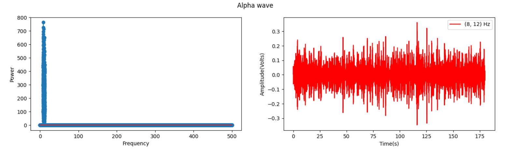

### Table of Contents

- **[Introduction](#introduction)**
- **[Technical](#technical)**
- **[Dependencies](#dependencies)**
- **[EEG waves](#eeg_waves)**
- **[Bibliography](#bibliography)**

## Introduction

Electroencephalography (EEG) is a method of recording the brain activity at the cortex level.
 
It is a non-invasive method consisting of placing electrodes in different places of the subject scalp.
 
The electrodes measure the electrical potential in that point with respect to a 0 potential point.
   

 
EEG data is usually prone to noise. Due to this fact intracranial electroencephalography (EEG)
was also developed in which the electrodes are directly placed on the subject's cortex.

## Technical

Fast Fourier Transform(FFT) algorithm is a widely known algorithm used for transitioning information back and forth 
between time and frequency domains.
 
Frequency domain signal analysis offers information about the `ingredients` (other signals) that signal is made of.

  
Removing an `ingredient`(base signal) from a frequency domain signal and transforming back in time domain 
the filtered signal will result in the disappearance of the `ingredient`(base signal) observed in time domain. 

e.g.: We have a blue signal formed out of the red and the green signals
  

  
We compute the Blue signal form in frequency domain. We observe it consists out of two `ingredients` found in 
**{3000, 15000}** points on the X axis, corresponding to the base signals from time domain. 
  

  

If we remove one `signal` from frequency domain and transform the signal back to time domain we get the 
other `signal`
  

  

## Dependencies

1) **bioread** for reading input iEEG file 
2) **numpy** for some operations
3) **matplotlib** for plotting information

## EEG waves

For this project we are using a real data recorded from a mouse cortex using intracranial EEG.
 
We process the signal from the frontal lobe.
  

  

We compute its frequency form.

  

  

And then, one by one we filter out the medicine related signals and compute the corresponding signal in time. 

  

  

  

  

  

  

  

## Bibliography

1) `https://en.wikipedia.org/wiki/Electroencephalography`
  
2) `https://en.wikipedia.org/wiki/Fast_Fourier_transform`
  
3) `https://pypi.org/project/bioread/`
  
4) `Fabien Lotte, Marco Congedo, Anatole Lécuyer, Fabrice Lamarche, Bruno Arnaldi. A review of
classification algorithms for EEG-based brain–computer interfaces. Journal of Neural Engineering,
IOP Publishing, 2007, 4, pp.24. inria-00134950`
  
5) `https://www.researchgate.net/publication/331250043_Deep_learning_for_EEG_data_analytics_A_survey`
  
6) `Fabien Lotte, Laurent Bougrain, Andrzej Cichocki, Maureen Clerc, Marco Congedo, et al.. A Review
of Classification Algorithms for EEG-based Brain-Computer Interfaces: A 10-year Update. Journal of
Neural Engineering, IOP Publishing, 2018, 15 (3), pp.55. 10.1088/1741-2552/aab2f2. hal-01846433`

